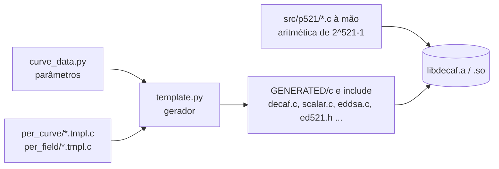

# Arquitetura da implementação EdDSA E‑521 na libdecaf

> Documento de arquitetura do TCC 2 (Eliseu Kadesh, UnB/FCTE).
> Descreve como a `libdecaf` é organizada, como a curva **E‑521** foi integrada,
> quais decisões de projeto foram tomadas e como a implementação foi validada.

---

## 1. Visão geral

A `libdecaf` é uma biblioteca em C99 para criptografia de curvas elípticas de alta
segurança (originada do trabalho de Mike Hamburg sobre Ed448‑Goldilocks e a técnica
Decaf/Ristretto). Sua característica arquitetural central é a **geração de código**:
o código C de cada curva **não** é escrito à mão, mas **produzido por um gerador em
Python** a partir de um único arquivo de parâmetros. Entender essa separação é a chave
para toda a integração da E‑521.

Há duas grandes partes:

- **Backend de corpo (field backend)** — escrito à mão, específico do primo `p`.
  Fica em `src/pXXX/` (ex.: `src/p25519/`, `src/p448/`, `src/p521/`). Implementa a
  aritmética modular: multiplicação, quadrado, adição, subtração, redução e raiz
  inversa. É otimizado por arquitetura (`arch_ref64/`, `arch_x86_64/`, `arch_32/`).

- **Camada de curva + protocolo** — gerada automaticamente. Modelos em
  `src/per_curve/*.tmpl.c` são transformados em código C pelo gerador. Para cada curva
  produz `decaf.c` (aritmética de pontos), `scalar.c` (aritmética modular à ordem `L`),
  `eddsa.c` (protocolo EdDSA), `elligator.c` (hash‑para‑curva do Ristretto) e
  `decaf_tables.c` (tabelas pré‑computadas do ponto base).

O "cérebro" é `src/generator/curve_data.py`: um dicionário Python com os parâmetros de
cada corpo e curva (primo, `d`, ordem, ponto base, configurações de janelas). Mudar um
parâmetro da curva = editar esse arquivo e regerar.



---

## 2. As três camadas do EdDSA E‑521

| Camada | Papel | Onde | Como foi feita |
|---|---|---|---|
| 1. Aritmética de corpo | operações mod `2^521−1` | `src/p521/` (à mão) | portada do "attic" e adaptada à interface atual |
| 2. Aritmética de curva/escalar | pontos e escalares mod `L` | `GENERATED/c/e521/{decaf,scalar}.c` | gerada de `curve_data.py["e521"]` |
| 3. Protocolo EdDSA | keygen, assinatura, verificação | `GENERATED/c/e521/eddsa.c` + `ed521.h` | gerada; ajustes específicos p521 |

### 2.1 Corpo `p521` (2^521 − 1)
Primo de **Mersenne**: a redução módulo `2^521−1` é feita por deslocamento e soma do
"carry" que passa do bit 521 de volta ao bit 0 (`gf_weak_reduce`). O elemento é
representado em **9 limbs**: 8 de 58 bits + 1 de 57 bits (`8·58 + 57 = 521`). A raiz
quadrada inversa `gf_isr` calcula `x^((p−3)/4)` (correta porque `p ≡ 3 (mod 4)`).

### 2.2 Parâmetros da curva (`curve_data.py["e521"]`)
`a = 1`, `d = −376014`, cofator `h = 4`, ordem primária
`L = 2^519 − 3375547632585017057891076304187826360719049612140512266186351500857791086­55765`.
O gerador calcula `q = (p + 1 − trace)/h`; o `trace` foi escolhido para que `q == L`
(verificado). Ponto base `G = (Gx, 12)`. Hash: **SHAKE256**, domínio `"SigEd521"`.
Chave pública/privada = 66 bytes, assinatura = 132 bytes.

### 2.3 API pública
Gerada em `decaf/ed521.h`: `decaf_ed521_derive_public_key`, `decaf_ed521_sign`,
`decaf_ed521_verify` (e variantes `_prehash`).

---

## 3. Decisões de projeto e correções

A E‑521 é a **primeira** curva da `libdecaf` cujo corpo tem exatamente **um bit além**
de um número inteiro de bytes (`521 = 8·65 + 1`) e cuja ordem (519 bits) **não** é
múltipla de 64. Isso expôs suposições latentes do gerador, corrigidas neste trabalho:

1. **`scalar_encode` (`per_curve/scalar.tmpl.c`)** — escrevia `SCALAR_LIMBS·8` bytes.
   Para a E‑521 são `9·8 = 72` bytes, mas só `65` são serializados → estouro de buffer
   que corrompia a assinatura. Corrigido limitando a `SCALAR_SER_BYTES` (seguro para
   todas as curvas).
2. **Clamp do EdDSA (`per_curve/eddsa.tmpl.c`)** — a regra genérica de "bit alto"
   `(1<<(bits%8))>>1` não é adequada ao caso `bits%8 == 1`; ajustada para p521 (byte
   mais significativo do escalar = `0x80`).
3. **`LIMB_PLACE_VALUE` (`src/p521/*/f_impl.h`)** — o limb superior vale 57 bits, não 58;
   `gf_strong_reduce`/`gf_serialize` propagam "carry" por esse valor.
4. **Ponto base das tabelas — "Option B" (`per_curve/decaf_gen_tables.tmpl.c`)** — a
   codificação **Decaf de 65 bytes** não está finalizada no upstream para p521
   (o mesmo `#error` do `elligator`). Em vez de decodificar o `rist_base` por esse
   caminho, o ponto base é reconstruído pelo **caminho EdDSA de 66 bytes**, que funciona:
   `real_point_base = decode_like_eddsa_and_mul_by_ratio(B_enc)` com `B_enc` = codificação
   de `(Gx, 12)`. (Validado: `mul_by_ratio_and_encode([1/4]·P)` reproduz a codificação do
   gerador.)
5. **Exclusão do Ristretto/`elligator`** — não é usado pelo EdDSA; permanece fora do
   build da E‑521 (documentado em `src/e521/CMakeLists.txt`).
6. **Multiplicação de base variável no EdDSA** — a pré‑computação de base fixa
   (comb/wnaf, `precompute()`) ainda produz pontos inválidos para o corpo p521; enquanto
   isso não é corrigido, `derive/sign/verify` usam a **multiplicação escalar de base
   variável** (verificada correta), guardada por `#if` apenas para a E‑521. É mais lenta,
   porém correta.

---

## 4. Integração ao build (CMake)

```
curve_data.py (p521, e521)      -> parâmetros
src/generator/e521/CMakeLists   -> gera decaf.c/scalar.c/eddsa.c e ed521.h/point_521.h
src/p521/CMakeLists             -> objeto 'p521' (aritmética de corpo)
src/e521/CMakeLists             -> objeto 'CURVE521' (curva + tabelas; elligator excluído)
src/CMakeLists                  -> liga p521/CURVE521 em decaf / decaf-static
```

Fluxo de compilação:

```bash
cmake -DENABLE_EXPERIMENTAL_E521=ON -DCMAKE_BUILD_TYPE=Release ..
make decaf-static           # gera código, compila e linka a biblioteca
make decaf_tables_e521      # gera src/e521/decaf_tables.c (tabelas do ponto base)
make decaf-static           # relinka com as tabelas reais
```

---

## 5. Validação

Duas linhas de evidência:

1. **Interoperabilidade com a referência** — a `libdecaf` reproduz **byte a byte** os
   **8 vetores de teste oficiais Ed521** do Apêndice C de Antunes (2021) — chave pública,
   assinatura e verificação, para mensagens de 0 a 1023 bytes. Teste: `test_penido.c`
   (+ `penido_vectors.h`, extraído do PDF).
2. **Corretude canônica** — as codificações de `[k]·G` conferem byte a byte com uma
   referência independente escrita do zero (`e521_ref.py`, inteiros grandes do Python,
   parâmetros canônicos da neuromancer.sk); + round‑trip sobre chaves aleatórias e
   rejeição de adulterações (`test_ed521.c`).

Resultado: **interoperabilidade total** com a implementação de referência.

> Nota: a reprodução dos vetores exigiu corrigir dois bugs específicos do corpo de 521
> bits (ver §3, itens 1–2): a redução de resumos longos (132 bytes) usava o raio de
> Montgomery `2^576` em vez do raio de bytes `2^520`, e a serialização de escalares
> escrevia 72 bytes em vez de 65. Ambos ficam ocultos em Ed25519/Ed448 (onde os raios
> coincidem) e na geração de chaves da E‑521 (byte superior zerado pelo clamp).

---

## 6. Limitações conhecidas / trabalho futuro

- Corrigir a pré‑computação de base fixa (`precompute`) para p521 e voltar ao caminho
  comb/wnaf (desempenho).
- Finalizar a codificação **Decaf/Ristretto de 65 bytes** para p521 (ajuste do bit alto
  em `elligator.tmpl.c` e no `point_encode/decode`).
- Backend de corpo p521 para **32 bits** (hoje apenas `arch_ref64`/`arch_x86_64`).
- Verificação cruzada de vetores de assinatura contra SageMath/PARI.
