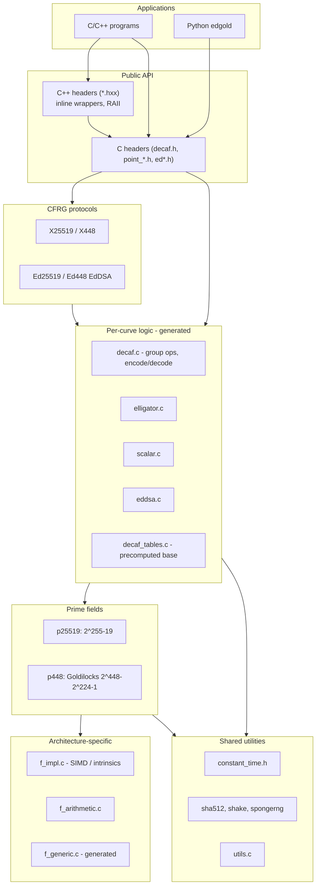
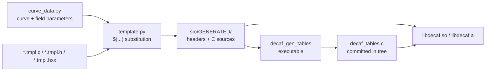

# Architecture

## High-level layers

## Data flow: point encoding (Ristretto)

Internally, points live on a twisted Edwards curve with `a = -1`, in extended homogeneous coordinates `(x, y, z, t)`. Wire format uses the **Ristretto** encoding (v0.9.4+):

1. Map to an isogenous **Jacobi quartic** curve.
2. Pick a **distinguished** representative among 4 or 8 equivalent points (sign rules on coordinates).
3. Serialize the **x-coordinate** only (32 bytes for 255-bit curves, 57 for Ed448).

This yields a canonical, cofactor-free byte string per group element.

## Build-time code generation pipeline

Most curve- and field-specific C/H files are **not** hand-maintained per curve; they are instantiated from templates using parameters in `src/generator/curve_data.py`.

[← Overview](01-overview.md) · [Next: Project structure →](03-project-structure.md)
