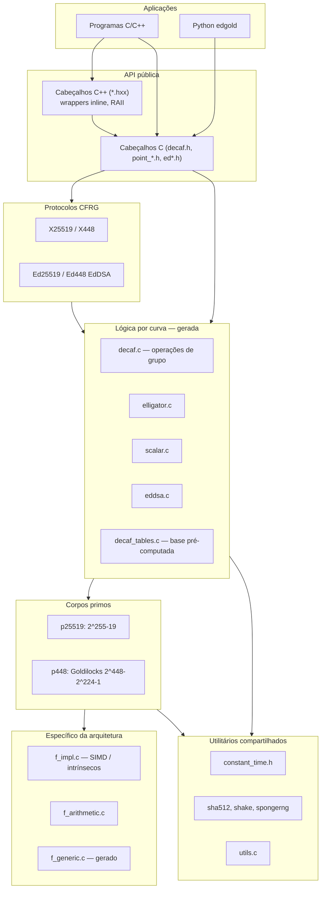
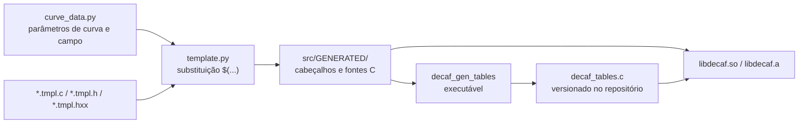

# Arquitetura

## Camadas de alto nível

## Fluxo de codificação de pontos (Ristretto)

Internamente, os pontos usam coordenadas homogêneas estendidas `(x, y, z, t)` em uma curva de Edwards torcida com `a = -1`. O formato em rede (*wire format*) segue a codificação **Ristretto** (a partir da v0.9.4):

1. Mapeamento por isogenia para uma curva **quártica de Jacobi**.
2. Escolha de um representante **distinguido** entre 4 ou 8 pontos equivalentes (regras de sinal nas coordenadas).
3. Serialização apenas da **coordenada x** (32 bytes na curva de 255 bits; 57 bytes no Ed448).

O resultado é uma sequência de bytes canônica por elemento do grupo, sem ambiguidade de cofator.

## Pipeline de geração de código na compilação

A maior parte do código específico por curva **não** é mantida manualmente para cada curva: instancia-se a partir de modelos (*templates*) parametrizados por `src/generator/curve_data.py`.

[← Visão geral](01-visao-geral.md) · [Próximo: Estrutura do projeto →](03-estrutura-do-projeto.md)
